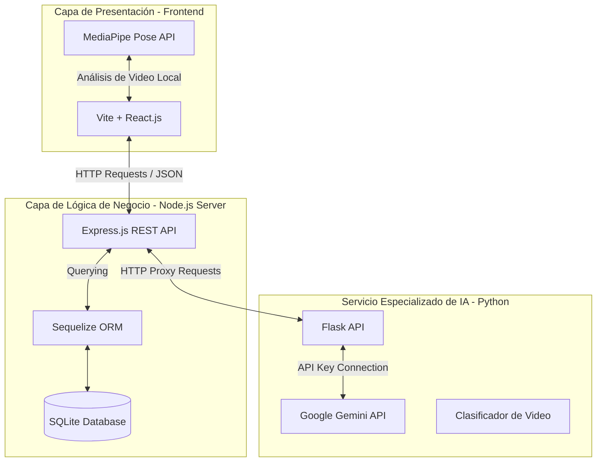
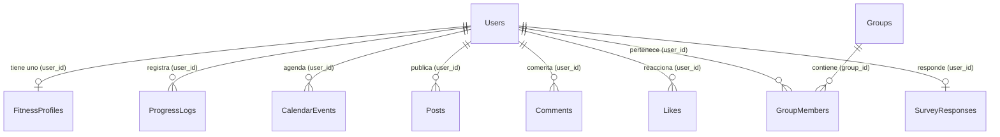

# FitNet 3.0 — Documento de Arquitectura y Especificación Tecnológica de Inteligencia Artificial

Este documento detalla la estructura lógica, la arquitectura de software y los módulos de Inteligencia Artificial (IA) del prototipo **FitNet**. Ha sido redactado con un enfoque académico riguroso para servir como base documental directa para el reporte de tesis.

---

## 1. Ficha Técnica del Prototipo
*   **Nombre del Software:** FitNet
*   **Tipo de Prototipo:** Aplicación Web de Red Social Fitness con Inteligencia Artificial.
*   **Población Objetivo:** Comunidad fitness del municipio de Timbío, departamento del Cauca.
*   **Objetivos del Sistema:** Facilitar la adherencia a la actividad física, propiciar el acompañamiento deportivo inteligente, clasificar de manera automática el contenido multimedia y evaluar la percepción del acompañamiento digital de los usuarios.

---

## 2. Arquitectura General del Sistema

El sistema utiliza una arquitectura **multicapa desacoplada** compuesta por tres pilares principales:

### A. Capa de Presentación (Frontend)
*   **Tecnologías:** Vite + React.js, Tailwind CSS (Hoja de estilos modularizada) y Lucide Icons.
*   **Descripción:** Interfaz de usuario interactiva y responsiva (Mobile-First) que gestiona el enrutamiento a través de `react-router-dom`. Incorpora los algoritmos de visión por computadora directamente en el cliente mediante la API de JavaScript.

### B. Capa de Negocio y Datos (Backend Principal)
*   **Tecnologías:** Node.js + Express.js.
*   **Base de Datos:** SQLite (Base de datos relacional ligera embebida, ideal para pruebas piloto en campo).
*   **ORM:** Sequelize (Mapeo Objeto-Relacional que abstrae y asegura las consultas SQL).
*   **Descripción:** Expone una API REST con rutas modulares protegidas por cifrado de contraseñas con `bcryptjs` y sesiones controladas mediante tokens JWT (JSON Web Tokens).

### C. Capa de Servicios de IA (Capa de Microservicios Python)
*   **Tecnologías:** Python 3 + Flask.
*   **Descripción:** Actúa como un microservicio dedicado a tareas de alta computación de Inteligencia Artificial. Escucha en el puerto `5000` y procesa solicitudes de clasificación multimedia y procesamiento de lenguaje natural enviadas desde el backend de Node.js mediante proxies internos.

---

## 3. Especificación Tecnológica de los Módulos de Inteligencia Artificial (IA)

FitNet incorpora cuatro componentes basados en técnicas de Inteligencia Artificial:

### A. Asistente Virtual Inteligente (Chatbot NLP)
El chatbot actúa como un Coach Deportivo interactivo integrado en la interfaz.

1.  **Motor Principal (Gemini LLM)**:
    *   **Modelo Utilizado:** `gemini-2.5-flash` de Google.
    *   **Procesamiento de Contexto:** Cada vez que el usuario realiza una consulta, el controlador de Node.js extrae la ficha del **Perfil Fitness IA** del usuario (edad, peso, meta, racha actual de días entrenados y el entrenamiento asignado para hoy) y lo concatena como un "Mensaje de Contexto" antes de enviarlo al microservicio de Python.
    *   **Configuración del Sistema (System Instruction):** El modelo está pre-entrenado con instrucciones específicas para actuar exclusivamente como *FitNet Coach*:
        > *"Eres FitNet Coach, el entrenador personal inteligente y amigable de la plataforma. Responde preguntas sobre entrenamiento, nutrición, hipertrofia, pérdida de grasa, rutinas, lesiones (recomendando ir al médico) y mentalidad fitness. Usa lenguaje motivador, profesional y respuestas de máximo 2 o 3 párrafos."*
2.  **Motor de Respaldo Local (NLP Basado en Reglas)**:
    *   Si no hay conexión a internet o la API Key de Gemini falla, el microservicio de Python ejecuta un procesador local de coincidencia semántica. Analiza palabras clave como *"proteína", "creatina", "grasa", "dolor", "lesión"* y devuelve respuestas pre-entrenadas para garantizar la disponibilidad del servicio.

### B. Clasificación Automática de Contenido Audiovisual
Este módulo analiza las publicaciones de los atletas de manera automática para etiquetar sus contenidos dentro del feed social de la comunidad.

1.  **Lógica del Servicio IA**:
    *   Cuando un usuario sube un video a la plataforma, el backend almacena temporalmente el archivo localmente y solicita una clasificación al microservicio de Python enviando la ruta absoluta del archivo y el texto de la descripción.
    *   El módulo `classifier.py` analiza el archivo multimedia mediante su algoritmo de detección de patrones y extrae el tipo de ejercicio físico y la intensidad.
2.  **Motor de Respaldo Semántico en Node.js**:
    *   Si el microservicio de IA de Python está inactivo, el backend de Node.js procesa sintácticamente la descripción utilizando un motor léxico local. Busca patrones lingüísticos (ej: si incluye *"sentadilla"* o *"squat"*, etiqueta el post de forma automatizada como `Ejercicio: Sentadillas`, `Músculo: Cuádriceps/Glúteos`, `Intensidad: Alta`).
3.  **Visualización en el Feed**:
    *   Cada publicación de video renderiza dinámicamente un bloque titulado **"Clasificación de Video IA"** con insignias interactivas que destacan el tipo de ejercicio, grupo muscular e intensidad calculados, indicando si se procesó mediante *Visión Artificial* o por el *NLP Analizador* de respaldo.

### C. Análisis de Postura Biomecánica (Cámara IA)
*   **Modelo de Visión:** **MediaPipe Pose** (desarrollado por Google).
*   **Funcionamiento:**
    1.  Utiliza la cámara en tiempo real mediante HTML5 WebRTC.
    2.  El modelo localiza **33 puntos de referencia corporales** (keypoints biomecánicos en 3D: rodillas, tobillos, caderas, hombros y codos).
    3.  **Cálculo Trigonométrico de Ángulos:** Mediante trigonometría vectorial en tiempo real, el sistema calcula la flexión articular:
        $$\theta = \arccos\left(\frac{\vec{u} \cdot \vec{v}}{\|\vec{u}\| \|\vec{v}\|}\right)$$
        Donde los vectores $\vec{u}$ y $\vec{v}$ representan los segmentos de la articulación (ej. cadera-rodilla y rodilla-tobillo para calcular el ángulo interno de la sentadilla).
    4.  **Clasificación de Postura:** Si el ángulo cae fuera del rango seguro definido (ej. espalda encorvada o flexión insuficiente), la interfaz alerta visualmente al usuario cambiando los colores de las líneas del esqueleto (Rojo = Técnica deficiente, Verde = Técnica óptima).
    5.  **Contador de Repeticiones:** Un algoritmo de máquina de estados detecta las fases concéntrica y excéntrica del ejercicio (ej. "abajo" y "arriba") controlando los picos de ángulos para incrementar el contador de repeticiones de manera automatizada.

### D. Algoritmo Predictivo de Alertas (Coach IA Central)
*   **Funcionamiento:** El backend evalúa de manera analítica el comportamiento histórico de entrenamientos del atleta:
    *   **Detección de Sobreentrenamiento:** Si el usuario registra entrenamientos 6 o más días en un intervalo de 7 días, emite una alerta preventiva recomendando descanso activo.
    *   **Detección de Sedentarismo:** Si el atleta acumula 3 o más días sin registrar actividad física, la IA emite un insight de motivación personalizado en su dashboard.
    *   **Evolución del Peso:** Compara el primer peso del perfil con el último registro de progreso para evaluar si la tendencia se alinea con el objetivo (ej. pérdida de grasa o ganancia de masa muscular).

---

## 4. Estructura de la Base de Datos (Esquema Relacional)

La base de datos relacional almacena 11 entidades clave representadas en Sequelize:

1.  **Users:** Almacena credenciales, roles (`athlete`, `trainer`, `admin`) y foto de perfil.
2.  **FitnessProfiles:** Perfil físico con edad, género, peso, altura, IMC, TDEE, objetivo y días disponibles.
3.  **ProgressLogs:** Bitácora histórica de variaciones de peso del usuario.
4.  **CalendarEvents:** Registro del plan de entrenamiento del mes (fecha, título, ejercicios, duración y estado: `pending`, `completed`, `missed`, `rest`).
5.  **Posts:** Publicaciones de la red social con enlaces a videos/imágenes y etiquetas `ai_tags` serializadas en formato JSON.
6.  **Comments / Likes:** Interacciones de la red social.
7.  **Groups / GroupMembers:** Comunidades administradas por los entrenadores.
8.  **SurveyResponses (Módulo Tesis):** Registro único de respuestas del piloto con escalas Likert del 1 al 5 para medir el acompañamiento digital, la adherencia y la pertenencia en Timbío.

---

## 5. Módulo de Evaluación Científica (Piloto Tesis)

Para dar soporte formal al **Objetivo Específico 3**, FitNet incorpora un sistema de evaluación cuantitativa del piloto en campo:

### A. Encuesta Digital Integrada
Los usuarios realizan el test de usabilidad y adherencia desde su panel:
1.  **Pregunta 1 (Acompañamiento):** Nivel de acompañamiento y guía provista por el Coach IA.
2.  **Pregunta 2 (Adherencia):** Impacto de los elementos de gamificación (rachas y calendario) en su motivación deportiva diaria.
3.  **Pregunta 3 (Usabilidad):** Facilidad de uso general del prototipo de software.
4.  **Pregunta 4 (Conexión Comunitaria):** Nivel de interacción alcanzado con deportistas locales de **Timbío**.
5.  **Pregunta 5 (Satisfacción):** Nivel de agrado general con la plataforma.

### B. Exportación de Datos Admin
El panel administrativo calcula los promedios matemáticos de las respuestas y permite a los investigadores la exportación completa de la tabla en un archivo delimitado por comas (`.csv`), facilitando la importación inmediata a herramientas estadísticas profesionales como **IBM SPSS Statistics** o **Excel** para el cálculo de variables académicas de tesis.
