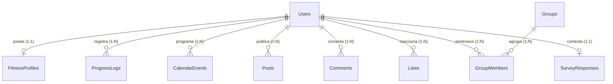

# MANUAL MAESTRO DE ESPECIFICACIÓN Y ARQUITECTURA: FITNET 3.0

Este documento es una especificación técnica de la aplicación **FitNet**. Detalla el propósito, la arquitectura de software, la base de datos, las funcionalidades completas y todos los componentes basados en Inteligencia Artificial (IA). 

---

## 1. INTRODUCCIÓN Y ESTRUCTURA DEL PROYECTO

**FitNet** es una plataforma integral de fitness y red social impulsada por Inteligencia Artificial, concebida en el marco de un proyecto de investigación para evaluar el acompañamiento digital y la adherencia al ejercicio físico en la comunidad del municipio de **Timbío, Cauca**.

### Objetivos Generales del Prototipo:
*   Facilitar la interacción social entre atletas y entrenadores locales.
*   Automatizar la planificación deportiva mediante recomendaciones dinámicas e inteligentes.
*   Validar la ejecución biomecánica del usuario mediante algoritmos de visión por computadora en el navegador.
*   Clasificar el contenido audiovisual de la comunidad fitness.
*   Ofrecer un canal de resolución de dudas con un chatbot conversacional avanzado.

---

## 2. ARQUITECTURA DE SOFTWARE (SISTEMA MULTICAPA)

La plataforma utiliza una topología de arquitectura **desacoplada de tres capas**:

```mermaid
graph TD
    subgraph Capa_Cliente [1. Capa de Presentación (Frontend Client)]
        React[Vite + React.js Client]
        WebRTC[Webcam HTML5 / Canvas API]
        MP[MediaPipe Pose JavaScript SDK]
    end

    subgraph Capa_Negocio [2. Capa de Lógica de Negocio (Backend Server)]
        Node[Node.js + Express.js REST API]
        Multer[Multer File Upload Handler]
        Nodemailer[Nodemailer Email Service]
        Seq[Sequelize ORM]
    end

    subgraph Capa_IA [3. Capa de Inteligencia Artificial (AI Microservice)]
        Flask[Python 3 + Flask API]
        Gemini[Google Gemini 2.5 Flash API]
        Classifier[Video Classifier Python Engine]
    end

    subgraph Capa_Datos [4. Capa de Almacenamiento (Database)]
        DB[(SQLite Database - fitnet.sqlite)]
    end

    React <-->|Consultas HTTP / JSON / Multipart| Node
    MP <-->|Coordenadas Biomecánicas| React
    Node <-->|Proxy HTTP Requests| Flask
    Flask <-->|API Key Keypoints| Gemini
    Node <-->|ORM Queries| Seq
    Seq <--> DB
```

### A. Capa de Presentación (Frontend)
Desplegada localmente en el puerto `5173` (mediante **Vite**):
*   **React.js**: Estructuración modular en base a componentes reactivos reutilizables.
*   **Tailwind CSS**: Hoja de estilos modular que implementa un tema visual oscuro premium (*Glow Dark Mode*), con bordes de cristal (*glassmorphic borders*), sombras interactivas y microanimaciones optimizadas para dispositivos móviles.
*   **MediaPipe SDK & TensorFlow.js**: Librerías cliente cargadas asíncronamente en el navegador que acceden a la webcam mediante WebRTC para procesar los frames de video de manera local, optimizando el ancho de banda y la latencia al evitar enviar flujo de video crudo al servidor.

### B. Capa de Lógica de Negocio (Backend Server)
Desplegada en el puerto `4000` (mediante **Node.js**):
*   **Express.js**: Servidor HTTP RESTful estructurado por enrutadores modulares.
*   **Seguridad**: Autenticación sin estado (*Stateless*) controlada mediante tokens **JWT (JSON Web Tokens)** con firma criptográfica simétrica, y cifrado de contraseñas mediante **bcryptjs** (10 rondas de salting).
*   **Carga de Archivos**: Integración de **Multer** para recibir archivos multimedia (imágenes de perfil, fotos/videos del feed) y guardarlos en directorios estáticos seguros.
*   **Nodemailer**: Módulo configurado para la entrega automatizada de correos SMTP con códigos numéricos de un solo uso (OTP) para la recuperación de contraseñas.

### C. Capa de Servicios de IA (Python AI Microservice)
Desplegada en el puerto `5000` (mediante **Python + Flask**):
*   **Flask API**: Servidor web ágil que actúa como pasarela dedicada para los motores de procesamiento pesado de Inteligencia Artificial.
*   **Integración Gemini**: Conector con el SDK oficial de **Google Generative AI** para procesar los prompts y el contexto en lenguaje natural.

---

## 3. ESPECIFICACIÓN DETALLADA DE LA BASE DE DATOS (MODELO RELACIONAL)

La persistencia de datos se realiza en un motor **SQLite**, administrado mediante **Sequelize ORM** con los siguientes modelos:



### Detalle de Campos por Tabla:
1.  **Users** (Usuarios):
    *   `id` (UUID, Primary Key)
    *   `username` (STRING, Único) - Nombre del atleta para menciones.
    *   `email` (STRING, Único) - Correo electrónico de acceso.
    *   `password_hash` (STRING) - Credencial encriptada.
    *   `full_name` (STRING) - Nombre y apellido.
    *   `profile_picture` (STRING) - Ruta local `/uploads/...` del archivo de imagen del usuario.
    *   `bio` (TEXT) - Biografía corta.
    *   `role` (ENUM: `'user'`, `'trainer'`, `'admin'`) - Control de accesos de la plataforma.
    *   `preferences` (JSON) - Configuración adicional.
2.  **FitnessProfiles** (Perfil Fitness IA):
    *   `id` (UUID, Primary Key)
    *   `user_id` (UUID, Foreign Key a Users)
    *   `age` (INTEGER) - Edad del usuario.
    *   `weight_kg` (DECIMAL) - Peso actual.
    *   `height_cm` (DECIMAL) - Estatura.
    *   `gender` (STRING) - Género físico.
    *   `activity_level` (ENUM: `'sedentary'`, `'lightly_active'`, `'moderately_active'`, etc.)
    *   `goal` (ENUM: `'lose_weight'`, `'build_muscle'`, `'maintain_weight'`, etc.)
    *   `days_per_week` (INTEGER) - Disponibilidad de entrenamiento semanal.
    *   `current_streak` (INTEGER) - Días seguidos entrenando.
    *   `max_streak` (INTEGER) - Racha máxima histórica del usuario.
    *   `total_workouts` (INTEGER) - Contador acumulativo de sesiones.
3.  **ProgressLogs** (Historial de Peso):
    *   `id` (INTEGER, Primary Key Auto-increment)
    *   `user_id` (UUID, Foreign Key)
    *   `weight_kg` (DECIMAL) - Registro numérico.
    *   `createdAt` (DATE) - Fecha del registro para el gráfico evolutivo.
4.  **CalendarEvents** (Calendario de Rutinas):
    *   `id` (INTEGER, Primary Key Auto-increment)
    *   `user_id` (UUID, Foreign Key)
    *   `date` (STRING: `'YYYY-MM-DD'`) - Día asignado.
    *   `title` (STRING) - Nombre de la rutina (ej. "Hombro y Abdomen").
    *   `exercises` (JSON) - Bloque de ejercicios con series, repeticiones y pesos.
    *   `duration_minutes` (INTEGER) - Duración estimada.
    *   `status` (ENUM: `'pending'`, `'completed'`, `'rest'`, `'missed'`)
5.  **Posts** (Feed Social):
    *   `id` (UUID, Primary Key)
    *   `user_id` (UUID, Foreign Key)
    *   `title` (STRING) - Título del post.
    *   `content` (TEXT) - Descripción de la publicación.
    *   `media_url` (STRING) - Enlace al archivo de imagen o video subido.
    *   `media_type` (ENUM: `'image'`, `'video'`, `'none'`)
    *   `ai_tags` (JSON) - Etiquetas asignadas por los módulos de clasificación de IA.
6.  **SurveyResponses** (Encuesta de Tesis):
    *   `id` (INTEGER, Primary Key Auto-increment)
    *   `user_id` (UUID, Foreign Key, Único) - Garantiza una respuesta por usuario.
    *   `q1_accompaniment` (INTEGER) - Escala Likert de 1 a 5.
    *   `q2_adherence` (INTEGER) - Escala Likert de 1 a 5.
    *   `q3_usability` (INTEGER) - Escala Likert de 1 a 5.
    *   `q4_community` (INTEGER) - Escala Likert de 1 a 5.
    *   `q5_satisfaction` (INTEGER) - Escala Likert de 1 a 5.
    *   `feedback` (TEXT) - Comentarios adicionales.

---

## 4. FUNCIONALIDADES DETALLADAS Y MÓDULOS DEL PROTOTIPO

### Módulo 1: Autenticación, Seguridad y Recuperación de Contraseña
*   **Flujo de Registro**: Creación de perfil asignando el rol (`athlete` o `trainer`). Al registrarse, se pre-inicializa un avatar genérico y se calcula el IMC automáticamente.
*   **Recuperación Segura por OTP**:
    1.  El usuario ingresa su correo en la vista de recuperación.
    2.  El servidor genera un código de 6 dígitos aleatorio con expiración de 15 minutos, almacenándolo en la tabla `PasswordResets`.
    3.  Se envía el código por email (o se simula en consola en entornos locales).
    4.  El cliente introduce el código, se valida en caliente, y se habilita la pantalla para redefinir la contraseña.

### Módulo 2: Red Social (Comunidad Fitness)
*   **Muro Central**: Feed dinámico que muestra las publicaciones de los atletas de la comunidad.
*   **Subida de Archivos**: Los posts soportan subidas físicas de archivos de imagen (`.jpg`, `.png`, `.webp`) y videos (`.mp4`, `.mov`).
*   **Interacciones**:
    *   Reacciones de "Me gusta" (Likes) con cambio de estado interactivo.
    *   Caja de comentarios reactiva.
    *   Sistema de seguidores (Follow/Unfollow) para estructurar el muro del usuario.
    *   Pestaña de búsqueda inteligente para localizar usuarios por nombre o rutinas por palabra clave.

### Módulo 3: Gamificación y Progreso
*   **Sistema de Rachas (Streaks)**: El sistema calcula dinámicamente si el usuario entrena en días consecutivos y aumenta su contador de días en racha.
*   **Nivel de Experiencia (XP & Levels)**: Cada entrenamiento completado suma `150 XP` al atleta. La interfaz calcula dinámicamente el nivel del atleta:
    $$\text{Nivel} = \lfloor \sqrt{\text{Total XP} / 100} \rfloor + 1$$
*   **Level Roadmap**: Representación interactiva que ilustra los hitos deportivos que desbloquea el usuario según su nivel acumulado.
*   **Gráfico Evolutivo**: Gráfico interactivo lineal en React que grafica el registro de peso corporal del atleta a lo largo del tiempo.

### Módulo 4: Directorio de Grupos y Monitoreo de Alumnos (Entrenadores)
*   **Creación de Comunidades**: Los usuarios con rol `trainer` (Coaches) pueden fundar grupos temáticos.
*   **Flujo de Admisión**: Los atletas solicitan unirse a un grupo. El entrenador tiene un panel donde aprueba o rechaza la solicitud.
*   **Métricas en Vivo del Alumno**: Al ingresar al grupo, el entrenador visualiza tarjetas de progreso de cada atleta activo que muestran el peso actual, el objetivo físico configurado, los entrenamientos completados en el mes y su racha activa.

---

## 5. ESPECIFICACIÓN TÉCNICA DE LOS MÓDULOS DE IA

FitNet destaca por la integración formal de componentes de Inteligencia Artificial para el guiado, asistencia y monitoreo del usuario.

### A. Asistente Conversacional Chatbot (FitNet Coach)
*   **IA Utilizada**: Modelo **Gemini 2.5 Flash** de Google.
*   **Inyección Dinámica de Contexto**: Para evitar respuestas genéricas, el backend intercepta el mensaje del usuario y le concatena variables del perfil:
    *   *Nombre del usuario, objetivo actual, racha de entrenamientos, total entrenamientos completados y la rutina asignada para el día de hoy.*
*   **Instrucciones del Sistema**: El LLM opera bajo directrices de personalidad fija: actuar como entrenador motivador, profesional, orientar sobre nutrición deportiva y rutinas de ejercicio, limitar respuestas a 3 párrafos y recomendar ir al médico en caso de dolor o lesión física.
*   **NLP Local de Respaldo**: En caso de caída de la red, el módulo de Python implementa un clasificador por coincidencia de términos semánticos en texto para resolver consultas frecuentes de nutrición, suplementación y rutinas sin coste de tokens ni latencia.

### B. Análisis Biomecánico y Detección de Postura en Tiempo Real
*   **Tecnología**: **MediaPipe Pose Engine** montado sobre el cliente de React.
*   **Metodología de Procesamiento**:
    1.  El navegador inicia la cámara del dispositivo.
    2.  MediaPipe procesa 30 frames por segundo localizando las coordenadas $(x, y, z)$ de 33 articulaciones corporales clave.
    3.  **Lógica del Ángulo Articular**: Para calcular la técnica del ejercicio, el frontend calcula el ángulo interior entre tres articulaciones contiguas (por ejemplo: Cadera, Rodilla y Tobillo para la Sentadilla). Utiliza la fórmula trigonométrica del arcocoseno del producto escalar de vectores:
        $$\theta = \arccos\left(\frac{\vec{a} \cdot \vec{b}}{\|\vec{a}\| \|\vec{b}\|}\right)$$
    4.  **Máquina de Estados de Repeticiones**:
        *   Estado `0` (Estático / Inicio del movimiento).
        *   Estado `1` (Fase Excétrica completa, ej. sentadilla abajo, ángulo $< 90^\circ$).
        *   Estado `2` (Fase Concéntrica completa, ej. atleta arriba, ángulo $> 160^\circ$).
        Una repetición válida solo se cuenta cuando la postura realiza la transición completa de estados de forma fluida.
    5.  **Feedback Visual**: Si el usuario no baja lo suficiente o desvía la espalda, el modelo lo detecta y renderiza el esqueleto virtual en color Rojo, arrojando textos de advertencia en vivo (ej. *"Baja más la cadera"*). Al corregir la técnica, el esqueleto se renderiza en Verde y continúa sumando repeticiones.

### C. Clasificación de Videos en el Feed Social
*   **IA de Clasificación**: Endpoints dedicados en Python Flask `/classify` y procesamiento lógico sintáctico en Node.js.
*   **Lógica de Clasificación**:
    1.  Cuando se publica un post con video, el microservicio analiza el texto de la descripción y los metadatos del video.
    2.  Clasifica y asigna etiquetas dinámicas categorizadas por:
        *   `exercise_type` (Sentadilla, Flexiones, Cardio, Pesas, Peso Muerto, Plancha).
        *   `muscle_group` (Cuádriceps, Pecho, Hombros, Abdomen, Espalda, Glúteos).
        *   `intensity` (Baja, Media, Alta).
    3.  **NLP de Respaldo**: Si el servicio de Python no responde, el servidor de Express ejecuta un parser regex local que analiza léxicamente las palabras del título y del contenido del post para aplicar los tags dinámicos correspondientes y evitar publicaciones sin clasificar.

### D. Algoritmo Predictivo de Alertas y Recuperación (Coach Central)
*   **Prevención de Lesiones**: Algoritmo analítico que monitorea el volumen de entrenamiento semanal. Si se detectan más de 5 días de actividad intensa en un lapso de 7 días, el dashboard de la IA despliega una tarjeta de advertencia recomendando descanso activo.
*   **Detector de Sedentarismo**: Si el sistema lee un diferencial de 3 o más días sin registrar entrenamientos en la base de datos de calendario, emite alertas motivadoras dirigidas a reactivar los hábitos deportivos del usuario.

---

## 6. MÓDULO CIENTÍFICO E INTEGRACIÓN DE TESIS

Para facilitar la evaluación de la percepción de acompañamiento y la adherencia en el piloto de campo (**Objetivo Específico 3**), el sistema posee un módulo científico exclusivo:

### A. Panel de Encuestas Integrado
Los atletas de la muestra de Timbío pueden ingresar a responder la encuesta digital desde su perfil. El formulario está validado para recibir un único formulario por usuario, utilizando una escala tipo Likert de 5 opciones (1: Muy en desacuerdo - 5: Muy de acuerdo).

### B. Exportación de Datos en Admin Panel
Los administradores del proyecto pueden acceder al panel administrativo privado, el cual calcula promedios generales automáticos de usabilidad y adherencia y ofrece un botón de **"Exportar Datos Tesis (CSV)"**. Este descarga un archivo delimitado por comas formateado con todas las respuestas individuales recolectadas, listo para ser importado directamente en suites de análisis cuantitativo profesional como **IBM SPSS Statistics** o **Microsoft Excel** para realizar cálculos de desviación estándar, correlaciones y pruebas de significancia.

---

## 7. COMANDOS DE TERMINAL PARA INSTALACIÓN Y EJECUCIÓN

Sigue estos comandos para ejecutar todo el ecosistema de **FitNet** en tu máquina:

### 1. Preparar el Microservicio de IA (Python)
Asegúrate de que estás en la carpeta `backend/ai`, ten instalado Python 3, configura tu `GEMINI_API_KEY` en el archivo `.env` local, e instala las dependencias:
```bash
cd backend/ai
pip install -r requirements.txt
python run_ai.py
```
*Servidor de IA listo en `http://localhost:5000`*

### 2. Iniciar el Servidor Backend (Node.js)
Abre otra terminal en la carpeta `backend`, instala las librerías necesarias y arranca el servidor:
```bash
cd backend
npm install
node server.js
```
*Servidor backend listo en `http://localhost:4000`*

### 3. Iniciar la Interfaz Web (React)
Abre otra terminal en la carpeta `frontend`, instala los paquetes de NPM y arranca el entorno de desarrollo:
```bash
cd frontend
npm install
npm run dev
```
*Frontend listo en `http://localhost:5173` (acceder en el navegador)*
